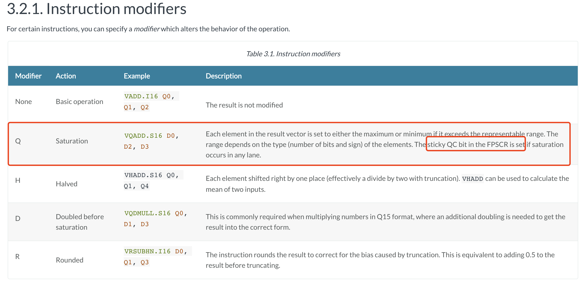
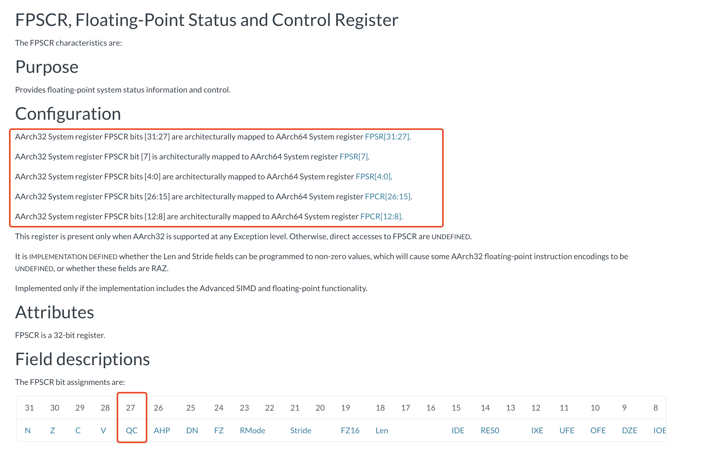
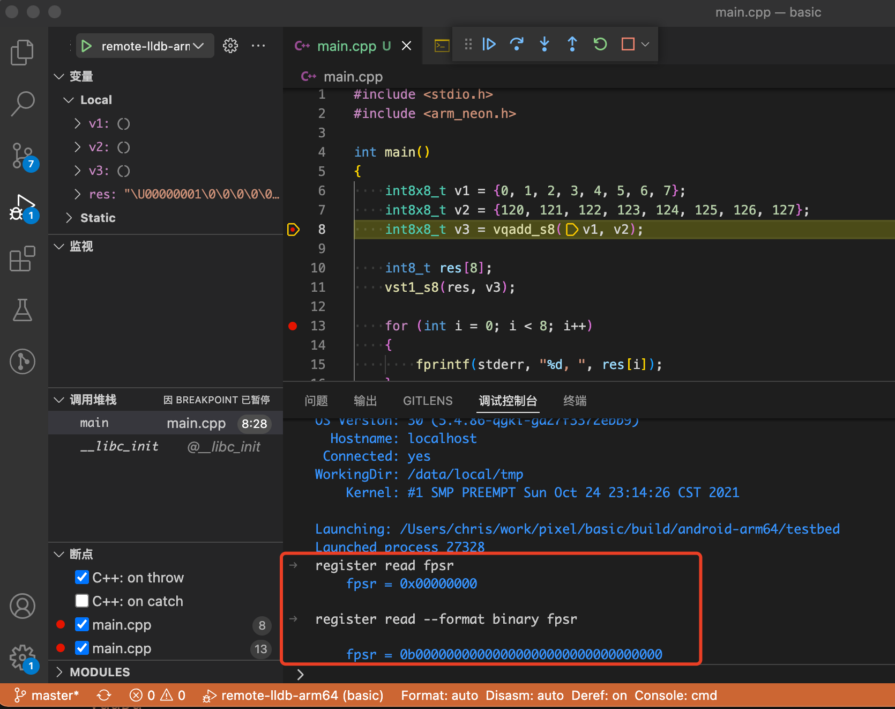
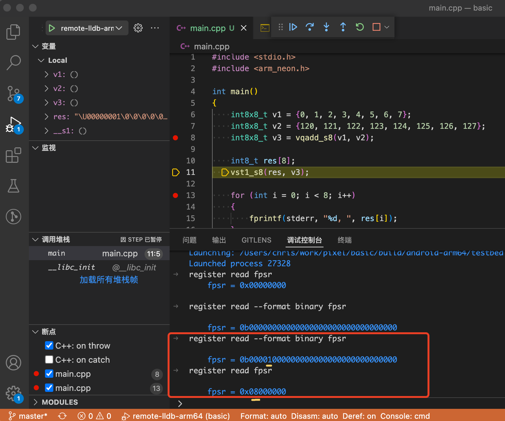

# Neon Intrinsics

## 概要
Neon Intrinsics 提供了类似 C/C++ 函数的方式来使用，数量有上千个（或更多），可在 https://developer.arm.com/architectures/instruction-sets/intrinsics/ 查询。

Neon Intrinsics 相比用 ARM 汇编的好处：
- 简单：像写 C/C++ 函数一样， 而不必纠结汇编的细枝末节
- 跨平台：arm32 和 arm64 的汇编中的向量寄存器指令格式不一样，而大部分 NEON Intrinsics 则一样（小部分则是 arm64 独有）

按经验， 如果目标设备的平台是手机那么基本上是 arm64， 而 android ndk 对 arm64 的优化比较好， intrinsic 的性能基本够用。
如果目标设备平台是 arm32， 那么很可能汇编比 intrinsic 有明显性能提升。

## 编写 NEON Intrinsics
严格说， 需在 ARM 设备上运行，比如 Android 手机（大部分都是 ARM 架构）， 或 ARM 开发板， 或 Apple M1/华为擎云电脑。

但如果没有这些设备，在 x86 架构的 PC 上仍然可以编写、编译、运行 NEON Intrinsics：
1. https://github.com/thenifty/neon-guide
这份指南给出了基本的用法， 你甚至不用编写和测试， 就体验到了 intrinsic 的优雅

2. SSE_2_NEON.h
网上有很多版本， 最初似乎是 Intel 的工程师编写的， 是用 SSE 指令来模拟 NEON 指令。
优点：PC 和 NEON 性能都不错。
缺点：可能有错误的指令模拟实现。

## 指令解释 - 以 vqadd 为例
指令格式： https://developer.arm.com/documentation/den0018/a/NEON-Instruction-Set-Architecture/Instruction-syntax
```
V{<mod>}<op>{<shape>}{<cond>}{.<dt>} <dest1>{, <dest2>}, <src1>{, <src2>}
```

其中 Q 表示饱和 Saturating， 意思是 clamp 到当前类型最小最大范围内。

文档提到了 modifier 的进一步参考： https://developer.arm.com/documentation/den0018/a/NEON-Instruction-Set-Architecture/Instruction-syntax/Instruction-modifiers?lang=en



文档有点老，提到的 FPCSR 寄存器是 ARM32 里的名字。在 ARM64 时候对应到 FPSR 寄存器, QC 位则对应到 FPSR 寄存器第28位（从低到高）：
https://developer.arm.com/documentation/ddi0595/2020-12/AArch32-Registers/FPSCR--Floating-Point-Status-and-Control-Register



即：**在arm64平台下，vqadd指令执行中若出现了饱和操作，则设定FPSR寄存器的QC位为1**。

验证方法很简单： 断点调试程序，调用 vqadd 并确保能触发饱和操作， 并在调用前后分别获取 fpsr 寄存器的值， 看第28位是否为1.

```c++
#include <stdio.h>
#include <arm_neon.h>

int main()
{
    int8x8_t v1 = {0, 1, 2, 3, 4, 5, 6, 7};
    int8x8_t v2 = {120, 121, 122, 123, 124, 125, 126, 127};
    int8x8_t v3 = vqadd_s8(v1, v2);

    int8_t res[8];
    vst1_s8(res, v3);

    for (int i = 0; i < 8; i++)
    {
        fprintf(stderr, "%d, ", res[i]);
    }
    fprintf(stderr, "\n");

    return 0;
}
```





可以看到在执行 vqadd_s8 后， fpsr 寄存器的值从 
0b00000000000000000000000000000000 
变为
0b00001000000000000000000000000000

其中变化的1，就是QC所在的28位。