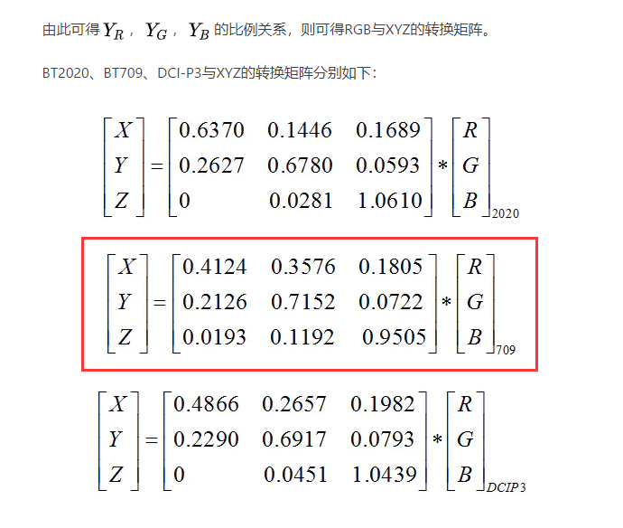

## 原理
https://www.jianshu.com/p/c34a313e12eb




## 评测
Basic config: Android ARMv8, OpenCV 4.5.0

**QCOM 845(XiaoMi 8)**
```
image info: height=512, width=512
rgb2xyz, naive impl,    time=6.8715 ms, x=0.3197, y=0.3351, z=0.3452
rgb2xyz, fused double,  time=2.0423 ms, x=0.3196, y=0.3350, z=0.3454
rgb2xyz, fused float,   time=1.9130 ms, x=0.3196, y=0.3350, z=0.3454
rgb2xyz, fused asimd,   time=1.0704 ms, x=0.3196, y=0.3350, z=0.3454
rgb2xyz, fused asimd2,  time=0.5871 ms, x=0.3196, y=0.3350, z=0.3454
rgb2xyz, fused asimd3,  time=0.5359 ms, x=0.3196, y=0.3350, z=0.3454
image info: height=4032, width=3024
rgb2xyz, naive impl,    time=115.4858 ms, x=0.3010, y=0.3184, z=0.3806
rgb2xyz, fused double,  time=33.5097 ms, x=0.2988, y=0.3162, z=0.3849
rgb2xyz, fused float,   time=33.2752 ms, x=0.2988, y=0.3162, z=0.3849
rgb2xyz, fused asimd,   time=15.6697 ms, x=0.2988, y=0.3162, z=0.3850
rgb2xyz, fused asimd2,  time=12.8382 ms, x=0.2988, y=0.3162, z=0.3849
rgb2xyz, fused asimd3,  time=7.2030 ms, x=0.2988, y=0.3162, z=0.3849
```

Initial: 115 ms, Current Best: 7 ms (fused asimd3), **16 times faster**

**QCOM 888(XiaoMi11)**
```
image info: height=512, width=512
rgb2xyz, naive impl,    time=3.5053 ms, x=0.3197, y=0.3351, z=0.3452
rgb2xyz, fused double,  time=0.3117 ms, x=0.3196, y=0.3350, z=0.3454
rgb2xyz, fused float,   time=0.2632 ms, x=0.3196, y=0.3350, z=0.3454
rgb2xyz, fused asimd,   time=0.0381 ms, x=0.3196, y=0.3350, z=0.3454
image info: height=4032, width=3024
rgb2xyz, naive impl,    time=55.7476 ms, x=0.3010, y=0.3184, z=0.3806
rgb2xyz, fused double,  time=15.1682 ms, x=0.2988, y=0.3162, z=0.3849
rgb2xyz, fused float,   time=14.8918 ms, x=0.2988, y=0.3162, z=0.3849
rgb2xyz, fused asimd,   time=1.9576 ms, x=0.2988, y=0.3162, z=0.3849
```
Comparing to naive impl(opencv), **28 times faster**