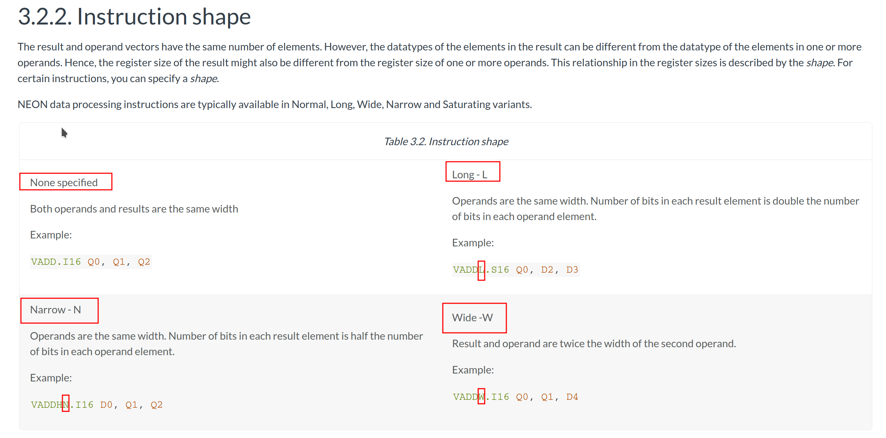

# Neon Intrinsics

## 概要
Neon Intrinsics 提供了类似 C/C++ 函数的方式来使用，数量有上千个（或更多），可在 https://developer.arm.com/architectures/instruction-sets/intrinsics/ 查询。

Neon Intrinsics 相比用 ARM 汇编的好处：
- 简单：像写 C/C++ 函数一样， 而不必纠结汇编的细枝末节
- 跨平台：arm32 和 arm64 的汇编中的向量寄存器指令格式不一样，而大部分 NEON Intrinsics 则一样（小部分则是 arm64 独有）

按经验， 如果目标设备的平台是手机那么基本上是 arm64， 而 android ndk 对 arm64 的优化比较好， intrinsic 的性能基本够用。
如果目标设备平台是 arm32， 那么很可能汇编比 intrinsic 有明显性能提升。

## 编写 NEON Intrinsics
严格说， 需在 ARM 设备上运行，比如 Android 手机（大部分都是 ARM 架构）， 或 ARM 开发板， 或 Apple M1/华为擎云电脑。

但如果没有这些设备，在 x86 架构的 PC 上仍然可以编写、编译、运行 NEON Intrinsics：
1. https://github.com/thenifty/neon-guide
这份指南给出了基本的用法， 你甚至不用编写和测试， 就体验到了 intrinsic 的优雅

2. SSE_2_NEON.h
网上有很多版本， 最初似乎是 Intel 的工程师编写的， 是用 SSE 指令来模拟 NEON 指令。
优点：PC 和 NEON 性能都不错。
缺点：可能有错误的指令模拟实现。

## Instruction syntax 指令语法
指令格式： https://developer.arm.com/documentation/den0018/a/NEON-Instruction-Set-Architecture/Instruction-syntax
```
V{<mod>}<op>{<shape>}{<cond>}{.<dt>} <dest1>{, <dest2>}, <src1>{, <src2>}
```

### 1. Modifier `<mod>` 的解释

以 `vqadd` 为例, 其中 Q 表示饱和 Saturating， 意思是 clamp 到当前类型最小最大范围内。

文档提到了 modifier 的进一步参考： https://developer.arm.com/documentation/den0018/a/NEON-Instruction-Set-Architecture/Instruction-syntax/Instruction-modifiers?lang=en


文档有点老，提到的 FPCSR 寄存器是 ARM32 里的名字。在 ARM64 时候对应到 FPSR 寄存器, QC 位则对应到 FPSR 寄存器第28位（从低到高）：
https://developer.arm.com/documentation/ddi0595/2020-12/AArch32-Registers/FPSCR--Floating-Point-Status-and-Control-Register


即：**在arm64平台下，vqadd指令执行中若出现了饱和操作，则设定FPSR寄存器的QC位为1**。

验证方法很简单： 断点调试程序，调用 vqadd 并确保能触发饱和操作， 并在调用前后分别获取 fpsr 寄存器的值， 看第28位是否为1.

```c++
#include <stdio.h>
#include <arm_neon.h>

int main()
{
    int8x8_t v1 = {0, 1, 2, 3, 4, 5, 6, 7};
    int8x8_t v2 = {120, 121, 122, 123, 124, 125, 126, 127};
    int8x8_t v3 = vqadd_s8(v1, v2);

    int8_t res[8];
    vst1_s8(res, v3);

    for (int i = 0; i < 8; i++)
    {
        fprintf(stderr, "%d, ", res[i]);
    }
    fprintf(stderr, "\n");

    return 0;
}
```


可以看到在执行 vqadd_s8 后， fpsr 寄存器的值从 
0b00000000000000000000000000000000 
变为
0b00001000000000000000000000000000

其中变化的1，就是QC所在的28位。

**其他 Modifier 的解释**
例子见 [modifier_exampples.cpp](modifier_exampples.cpp)

### 2. Shape Modifier `<shape>` 的解释


- None specified
未指定， 意思是所有输入和结果向量的元素位宽相同（通常是相同类型， 少部分情况则是不同类型）
- Long - L
长指令， 意思是所有输入向量位宽相同， 结果位宽是输入元素的2倍


- Narrow - N
窄指令， 意思是所有输入向量位宽相同， 结果位宽是输入元素的一半


- Wide -W
宽指令， 意思是第一个输入向量位宽是第二个输入向量位宽的2倍， 结果向量的位宽取第一个输入向量的位宽（宽的那个）


例子见 [shape_examples.cpp](shape_examples.cpp)

### 3. `<cond>`
>`<cond>`:
>Condition, used with `IT` instruction.

没理解。IT 是啥？

### 4. `<.dt>`
>`<.dt>`
>Data type. See NEON data types.
没理解。

[3.3. Specifying data types](https://developer.arm.com/documentation/den0018/a/NEON-Instruction-Set-Architecture/Specifying-data-types?lang=en)

感觉这里说的是汇编的写法。注意点：
- If the description specifies `I`, you can also use `S` or `U` data types
- If only the data size is specified, you can specify a type (`I`, `S`, `U`, `P` or `F`)
- If no data type is specified, you can specify a data type. 
- The `F16` data type is only available on systems that implement the half-precision architecture extension and only applies to conversion.


[3.4. Packing and unpacking data](https://developer.arm.com/documentation/den0018/a/NEON-Instruction-Set-Architecture/Packing-and-unpacking-data?lang=en)
NEON 有高效的打包（pack）、解包（unpack）指令。然而这些指令， 在 intrinsics 里是不可见的。。pack 和 unpack 有啥用， 有具体例子吗？？
```asm
# Unpack to two registers
UXTH r1, r0, ROR #16

# Pack back to one register
PKHBT r0, r2, r1, LSL #16
```

### 对齐（alignment）
[3.5. Alignment](https://developer.arm.com/documentation/den0018/a/NEON-Instruction-Set-Architecture/Alignment?lang=en)

The NEON architecture provides full unaligned support for NEON data access. However, the instruction opcode contains an alignment hint which permits implementations to be faster when the address is aligned and a hint is specified. However, if the alignment is specified but the address is incorrectly aligned, a Data Abort occurs

The base address specified as `[<Rn>:<align>]`

NEON 的汇编指令，可以增加“暗示”，表示数据是对齐的。

NEON 允许数据地址是不对齐的， 但是如果地址是对齐的并且有正确的hint， 计算就会加速。

如果指定了地址对齐的 hint， 但实际给的地址不是对齐的， 就发生 abort。（啥？不应该是 bus error 吗？）

关于地址对齐的（汇编）语法：
- `[Rn:128]` 是最好的
- `[Rn,:128]` 增加了一个逗号， 也能被 GNU 的 gas 编译器接受
- `@` 在 ARM Architecture Reference Manual 中使用了 `@` 符号来描述，但是在代码里不建议这么写（why？这到底是在说啥？？）
- 允许对齐的位数： 64， 128， 256
- 对齐的好处： 可以减少时钟周期
    - 对于 cortext-a8 系列处理器来说， 指定 128 或更高的位数的地址对齐， 能减少1个cycle
    - 对于 cortext-a9 系列处理器来说， 指定 64 或更高的位数的地址对齐， 能减少 1个 cycle

### 浮点操作
[3.7. Floating-point operations](https://developer.arm.com/documentation/den0018/a/NEON-Instruction-Set-Architecture/Floating-point-operations?lang=en)

NEON floating-point is not fully compliant with IEEE-754
NEON 浮点操作不是 IEEE-754 完全一致的

Denormals are flushed to zero
？？

Rounding is fixed to round-to-nearest except for conversion operations
转换操作之外的 rounding， 策略是“舍入到最近”

Single precision arithmetic (.F32) only
只提供单精度计算。（float32）

Separate (scalar) floating-point instructions.


[3.8. Flush-to-zero mode](https://developer.arm.com/documentation/den0018/a/NEON-Instruction-Set-Architecture/Flush-to-zero-mode?lang=en)

Flush-to-zero 模式意思是， 替换 denormalized 的数字为 0. 这会导致和 IEEE 754 的结果不一样。

[3.8.2. The effects of using flush-to-zero mode](https://developer.arm.com/documentation/den0018/a/NEON-Instruction-Set-Architecture/Flush-to-zero-mode/The-effects-of-using-flush-to-zero-mode?lang=en)

With certain exceptions, flush-to-zero mode has the following effects on floating-point operations:

    A denormalized number is treated as 0 when used as an input to a floating-point operation. The source register is not altered.

    If the result of a single-precision floating-point operation, before rounding, is in the range -2-126 to +2-126, it is replaced by 0.

    If the result of a double-precision floating-point operation, before rounding, is in the range -2-1022 to +2-1022, it is replaced by 0. 

An inexact exception occurs whenever a denormalized number is used as an operand, or a result is flushed to zero. Underflow exceptions do not occur in flush-to-zero mode.

即：
- 对于 denormalized 的浮点数， 如果作为浮点操作的输入， 则被当做0看待， 源寄存器不会被改变
- 如果一个浮点操作的float结果在舍入前处于 $[-2^{-126}, +2^{-126}]$ 范围， 那么舍入后的结果为0
- 如果一个浮点操作的double结果在舍入前处于 $[-2^{-1022}, +2^{-1022}]$ 范围， 那么舍入后的结果为0

即：不精确的结果， 在两种情况下发生
- denormalized 的浮点数作为输入时
- 结果被 flush-to-zero

[3.8.3. Operations not affected by flush-to-zero mode](https://developer.arm.com/documentation/den0018/a/NEON-Instruction-Set-Architecture/Flush-to-zero-mode/Operations-not-affected-by-flush-to-zero-mode?lang=en)

这个小节说， 很多指令不受 flush-to-zeros 的影响（直白点不好吗， 非计算操作都不会把 denormalized 的浮点数改为0）：

The following NEON operations can be carried out on denormalized numbers even in flush-to-zero mode, without flushing the results to zero:
- copy, absolute value, and negate (VMOV, VMVN, V{Q}ABS, and V{Q}NEG)
- duplicate (VDUP)
- swap (VSWP)
- load and store (VLDR and VSTR)
- load multiple and store multiple (VLDM and VSTM)
- transfer between NEON registers and ARM general-purpose registers (VMOV). 

[3.9.1. Shifting vectors](https://developer.arm.com/documentation/den0018/a/NEON-Instruction-Set-Architecture/Shift-operations/Shifting-vectors?lang=en)
NEON 指令中的移位， 移动的位数可以是标量， 也可以是放在向量中。
移位时， 移动的位数被看做是有符号的值， 因此移动0位也是可以的（为啥不是看做无符号的值呢？移动负值位数也可以吗？明显不行的）

>A right shift operating on a vector of signed elements, indicated by the type attached to the instruction, will sign extend each element. This is the equivalent of an arithmetic shift in ARM code. Shifts applied to unsigned vectors do not sign extend.
对于被移位的输入向量来说， 在右移时符号位也会被跟着移动.

举例： -128 右移3位：
```
    // -128: 10000000
    //    11110000
    // -16:  11110000
```
见 [shift_example.cpp](shift_example.cpp)。

即： 带插入的移位指令（能够更快吗？）
vsri_n_type:
vsriq_n_type:
vsli_n_type:
vsliq_n_type:


## AOS v.s. SOA
AOS, Array of Struct
```c++
struct Vec3
{
    float x;
    float y;
    float z;
};

Vec3[4] vec;
process(vec);
```

SOA, Struct of Array
```c++
struct soa_vec3
{
    float x[4];
    float y[4];
    float z[4];
};

soa_vec3 sv;
process(sv);
```

plain C/C++ 常见 AOS， 而 SOA 则往往更适合 SIMD 加速。因而实际常执行如下流程：
AOS -> SOA -> SIMD compulate -> AOS

[高性能C++之SIMD - Bilibili 寒海明灯](https://www.bilibili.com/video/BV1zA41157fE)