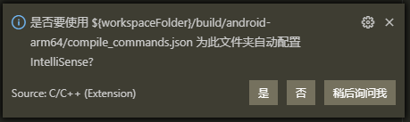

# ncnn 源码阅读笔记

[TOC]

## 0x0 目的

看 ncnn 学 arm neon 的 intrinsics 和 assembly，学习 ARM 端的优化技能。

## 0x1 准备

我觉得一套齐全的工具包括而不限于：
GUI软件：VSCode, CLion, SourceTail, AndroidStudio, SmartGit;
编译器：NDK-r21b; Clang / VS2019
命令行：cmake, git, tig, ag

ARM NEON 的几个入门帖：
- https://blog.csdn.net/Roland_Sun/article/details/42921131
- https://blog.csdn.net/emsoften/article/details/51718763
- https://aijishu.com/a/1060000000116427

**VSCode设置**

这里对 VSCode 的设置做说明：怎样让它识别 `__ARM_NEON`宏，代码不要灰色显示？怎样跳转到`vld3_u8`这样的宏/函数定义？

step1: cmake版本

确保cmake版本>3.9，如果有Python环境，可以`pip install cmake`快速安装

step2: 生成 compile_commands.json 文件

CMakeLists.txt里添加`set(CMAKE_EXPORT_COMPILE_COMMANDS ON)`，或调用cmake时传入`-DCMAKE_EXPORT_COMPILE_COMMANDS=ON`

step3: VSCode 插件

确保安装3个插件：C/C++, CMake Tools, CMake。

step4: 改 c_cpp_properties.json

添加一个NDK的配置项。最重要的是编译器路径，以及指定`"intelliSenseMode": "clang-arm64"`。

例如在Windows下我的配置：
```json
{
    "configurations": [
        {
            "name": "Win32",
            "includePath": [
                "${workspaceFolder}/**"
            ],
            "defines": [
                "_DEBUG",
                "UNICODE",
                "_UNICODE"
            ],
            "windowsSdkVersion": "10.0.18362.0",
            "compilerPath": "C:/Program Files (x86)/Microsoft Visual Studio/2019/Community/VC/Tools/MSVC/14.28.29333/bin/Hostx64/x64/cl.exe",
            "cStandard": "c17",
            "cppStandard": "c++17",
            "intelliSenseMode": "msvc-x64",
            "compileCommands": "${workspaceFolder}/build/vs2019-x64/compile_commands.json"
        },
        {
            "name": "NDK-r21b",
            "includePath": [
                "${workspaceFolder}/**"
            ],
            "defines": [],
            "compilerPath": "E:/soft/Android/ndk-r21b/toolchains/llvm/prebuilt/windows-x86_64/bin/clang++.exe",
            "cStandard": "c11",
            "cppStandard": "c++11",
            "intelliSenseMode": "clang-arm64",
            "compileCommands": "build/android-arm64/compile_commands.json"
        }
    ],
    "version": 4
}
```
然后VSCode里打开任意一个.h/.c/.cpp文件，右下角状态栏选择NDK-r21b




或者，关掉VSCode，删除.vscode目录，重新打开，过几秒会自动弹窗提示选择compile_commands.json文件：


只不过这种情况下，`c_cpp_properties.json`里的编译器可能还是x86平台的编译器而不是NDK里的。

step5: 消除红色波浪线

Linux和早些时候的Windows上，VSCode不识别`__fp16`和`vld3_u8`等关键字，显示为红色波浪下划线。

VSCode->文件->首选项->设置，搜索 `Intelli Sense Engine`，把 `Default` 改成 `Tag Parser`，红色波浪线就消失了！

（其实是Intelli Sense的Parser的问题，https://github.com/microsoft/vscode-cpptools/issues/6506）

## 0x2 Mat类的 from_pixels 函数
`from_pixels()`的实现，是根据FLAG，调用不同的函数，其中最常用的是:
- `from_rgb()`
- `from_rgb2bgr()`

### 0x201 from_rgb 函数
```c++
//mat_pixel.cpp

/**
 * 从raw buffer创建Mat对象
 * 维度顺序：HWC => CHW
 * 数据类型：uchar => float
 * ARMv8平台使用了neon intrinsics实现加速
 * @param rgb 图像raw buffer，HWC顺序
 * @param w 图像宽度
 * @param h 图像高度
 * @return Mat对象，CHW顺序
 */
static Mat from_rgb(const unsigned char* rgb, int w, int h);
```

ncnn的实现，是把pure C和arm intrinsics以及arm assembly放在同一个函数中，用宏控制不同的代码分支。为了便于理解，按pure C, arm intrinsics分别写为函数，并增加注释。其中“C版本实现”指的是naive C/C++实现。

```c++
// C版本的from_rgb实现
ncnn::Mat from_rgb_c(const unsigned char* rgb, int w, int h) {
    ncnn::Mat m(w, h, 3); // 创建3通道图像
    if (m.empty()) {
        return m;
    }

    // 创建3个指针，分别指向刚创建图像的3个通道
    // 注意：源buffer的每个bgr是连续的，而目标buffer的bgr是分开的
    // 也就是：ncnn::Mat是CHW顺序，而cv::Mat是HWC顺序
    // 因此，from_rgb函数，不能简单的用memcpy实现
    // 但如果用NHWC顺序做CNN推理，则from_rgb可用memcpy甚至浅拷贝实现
    float* ptr0 = m.channel(0);
    float* ptr1 = m.channel(1);
    float* ptr2 = m.channel(2);

    int size = w * h;
    int remain = size;
    for (int i=0; i<remain; i++) {
        *ptr0 = rgb[0];
        *ptr1 = rgb[1];
        *ptr2 = rgb[2];

        rgb += 3;
        ptr0++;
        ptr1++;
        ptr2++;
    }
    return m;
}
```

```c++
// neon intrinsics版本的from_rgb
ncnn::Mat from_rgb_neon_intrinsics(const unsigned char* rgb, int w, int h)
{
    ncnn::Mat m(w, h, 3);
    if (m.empty()) {
        return m;
    }

    float* ptr0 = m.channel(0);
    float* ptr1 = m.channel(1);
    float* ptr2 = m.channel(2);

    int size = w * h;

    int nn = size >> 3; // size / 8
    int remain = size - (nn<<3); // size - ((size/8)*8)

    for (; nn>0; nn--) {
        // vld3_u8: 按交叉顺序将内存的数据装入3个neon寄存器(d寄存器）
        // 其中每个d寄存器的每个通道(lane)是8个bit，每个d寄存器是64位，也就是8个lane
        // 通道(lane)的意思，是把寄存器看做是基本长度(size)的向量，每个向量元素是一个lane
        // 内存第1个数据放入第1个d寄存器的第1个通道，
        // 内存第2个数据放入第2个d寄存器的第1个通道,
        // 内存第3个数据放入第3个d寄存器的第1个通道,
        // 内存第4个数据放入第1个d寄存器的第2个通道,
        // 内存第5个数据放入第2个d寄存器的第2个通道,
        // 内存第6个数据放入第3个d寄存器的第2个通道,
        // ...
        // 内存第22个数据放入第1个d寄存器的第8个通道,
        // 内存第23个数据放入第2个d寄存器的第8个通道,
        // 内存第24个数据放入第3个d寄存器的第8个通道,
        uint8x8x3_t _rgb = vld3_u8(rgb);

        // 将vector的元素bit位扩大到原来的两倍，元素值不变。
        // 目的是什么？防止溢出吗？其实是为了u8=>float32的类型转换
        // 通常，cnn的输入是float类型，手动u8=>float效率并不高
        // 这里是把u8=>float用neon intrinsic实现了
        uint16x8_t _r16 = vmovl_u8(_rgb.val[0]);
        uint16x8_t _g16 = vmovl_u8(_rgb.val[1]);
        uint16x8_t _b16 = vmovl_u8(_rgb.val[2]);

        // vget_low_u16(_r16)是取_r16的低一半（64位)
        float32x4_t _rlow = vcvtq_f32_u32(vmovl_u16(vget_low_u16(_r16)));
        // vget_high_u16(_r16)是取_r16的高一半（64位）
        float32x4_t _rhigh = vcvtq_f32_u32(vmovl_u16(vget_high_u16(_r16)));

        float32x4_t _glow = vcvtq_f32_u32(vmovl_u16(vget_low_u16(_g16)));
        float32x4_t _ghigh = vcvtq_f32_u32(vmovl_u16(vget_high_u16(_g16)));

        float32x4_t _blow = vcvtq_f32_u32(vmovl_u16(vget_low_u16(_b16)));
        float32x4_t _bhigh = vcvtq_f32_u32(vmovl_u16(vget_high_u16(_b16)));

        vst1q_f32(ptr0, _rlow);
        vst1q_f32(ptr0+4, _rhigh);

        vst1q_f32(ptr1, _glow);
        vst1q_f32(ptr1+4, _ghigh);

        vst1q_f32(ptr2, _blow);
        vst1q_f32(ptr2+4, _bhigh);

        rgb += 3*8;
        ptr0 += 8;
        ptr1 += 8;
        ptr2 += 8;
    }

    for (; remain>0; remain--) {
        *ptr0 = rgb[0];
        *ptr1 = rgb[1];
        *ptr2 = rgb[2];

        rgb += 3;
        ptr0++;
        ptr1++;
        ptr2++;
    }

    return m;
}
```

实测性能：
```
// 输入图像尺寸 width=3880, size=5184
// 重复10次
// from_rgb_c耗时 1320 ms
// from_rgb_neon_intrinsics耗时 1230 ms
```

顺带，其他几个函数，我感觉cnn里几乎用不到，就不分析了：
```c++
        if (type == PIXEL_RGB || type == PIXEL_BGR)
            return from_rgb(pixels, w, h); //分析了

        if (type == PIXEL_GRAY)
            return from_gray(pixels, w, h); //感觉用不到

        if (type == PIXEL_RGBA)
            return from_rgba(pixels, w, h); //感觉用不到
```

### 0x202 from_rgb2bgr 函数

和`from_rgb`函数的功能与作用几乎一样（读取uchar类型数据，逐像素转为float并赋值给Mat的data，并且维度顺序从HWC转为CHW），唯一的区别是b和r通道的指针交换一下，也就是：
```c++
        vst1q_f32(ptr0, _rlow);
        vst1q_f32(ptr0+4, _rhigh);

        vst1q_f32(ptr1, _glow);
        vst1q_f32(ptr1+4, _ghigh);

        vst1q_f32(ptr2, _blow);
        vst1q_f32(ptr2+4, _bhigh);
```
改成：
```c++
        vst1q_f32(ptr2, _rlow);
        vst1q_f32(ptr2+4, _rhigh);

        vst1q_f32(ptr1, _glow);
        vst1q_f32(ptr1+4, _ghigh);

        vst1q_f32(ptr0, _blow);
        vst1q_f32(ptr0+4, _bhigh);
```

以及把：
```c++
        *ptr0 = rgb[0];
        *ptr1 = rgb[1];
        *ptr2 = rgb[2];
```
改成：
```c++
        *ptr0 = rgb[2];
        *ptr1 = rgb[1];
        *ptr2 = rgb[0];
```

## 0x21 Mat类的 to_pixels 函数
`to_pixels()`的实现，是根据FLAG，调用不同的函数，其中最常用的是:
- `to_rgb()`
- `to_bgr2rgb()`

### 0x211 to_rgb 函数


### 0x212 to_bgr2rgb 函数