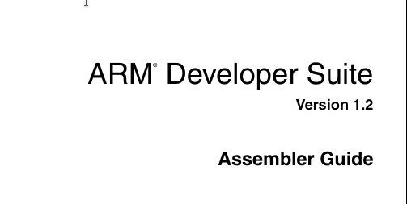
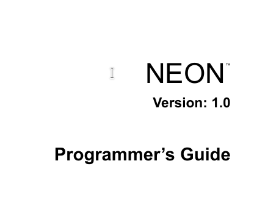
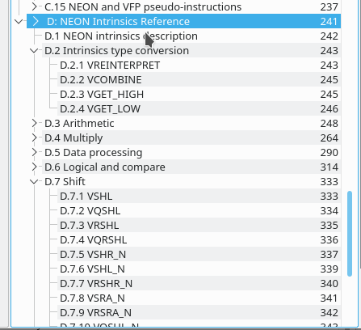

# arm assembly instructions

## 1. 目的
arm 汇编指令在编写或查看汇编代码时会被用到， 主要资料是看 arm 官方文档．　考虑到文档是英文写成且内容丰富（以至于汇编指令有种被淹没的感觉），　这里稍微加强标记出具体位置，以便使用．

## 2. ARM32 汇编指令
### ARM32 常规汇编
ARM® Cortex-A Series Version: 4.0 Programmer’s Guide

(直接访问　https://documentation-service.arm.com/static/5ff5c9fd89a395015c28fc51?token=　，　或 google 搜索 Programmer’s Guide for ARMv7 )

也可以看 "ARM Developer Suite Assembler Guide" 这一文档的 chapter4:

### ARM32 neon 汇编
"NEON Programmer's Guide"

这本书里头专门讲 neon 的，　里面按 intrinsic 列出，　然后每个 intrinsic 写出了对应的 assembly.(附录D):

## 3. ARM64 汇编指令
### ARM64 常规汇编
来自 "ARM® Cortex®-A Series Version: 1.0 Programmer’s Guide for ARMv8-A" (DEN0024A_v8_architecture_PG.pdf) 的 chapter 6.

### ARM64 neon 向量汇编指令
在 cortex-a 系列的 arm64 手册中， chapter 7 给出了 ARM64 NEON 指令的介绍:

它们是基于　arm32 的 neon 指令修改而来，　去掉了 "v" 前缀，　看起来和常规的汇编指令一样了，　但其实根据参数（寄存器）类型，　以及是否有划分("v0.2D")　来区分：

### multiply instructions
| opcode | description |
| ------ | ----------- |
| MADD   | Multiply add |
| MNEG   | Multiply negate |
| MSUB   | Multiply subtract |
| MUL    | Multiply |
| SMADDL | Signed multiply-add long |
| SMNEGL | Signed multiply-negate long |
| SMSUBL | Signed multiply-subtract long |
| SMULH | Signed multiply retuning high half |
| SMULL | Signed multiply long |
| UMADDL | Unsigned multiply-add long |
| UMNEGL | Unsigned multiply-negate long |
| UMSUBL | Unsigned multiply-subtract long |
| UMULH  | Unsigned multiply returning high half |
| UMLL   | Unsigned multiply long |

### divide instructions
| opcode | description |
| ------ | ----------- |
| SDIV   | Signed divide |
| UDIV   | Unsigned divide |

### shift instructions
| opcode | description |
| ------ | ----------- |
| ASR    | Arithmetic shift right |
| LSL    | Logical shift left |
| LSR    | Logical shift right |
| ROR    | Rotate right |

### mov instructions
| opcode | description |
| ------ | ----------- |
| MOV    | Move |
| MVN    | Bitwise NOT |

### conditional instructions
跳过．　主要是检查 flags

### load instructions
offset addressing modes:
| opcode | description |
| ------ | ----------- |
| LDR X0, [X1] | Load from the address in X1 |
| LDR X0, [X1, #8] | Load from address X1 + 8 |
| LDR X0, [X1, X2] | Load from address X1 + X2 |
| LDR X0, [X1, X2, LSL, #3] | Load from address X1 + (X2 << 3) |
| LDR X0, [X1, W2, SXTW] | Load from address X1 + sign_extend(W2) |
| LDR X0, [X1, W2, SXTW, #3] | Load from address X1 + (sign_extend(W2) << 3) |

Index addressing modes:
| opcode | description |
| ------ | ----------- |
| LDR X0, [X1, #8]! | Pre-index: Update X1 first (to X1 + #8), then load from the new address |
| LDR X0, [X1], #8 | Post-index: Load from the unmodified address in X1 first, then update X1 (to X1 + #8) |
| STP X0, X1, [SP, #-16]! | Push X0 and X1 to the stack |
| LDP X0, X1, [SP], #16 | Pop X0 and X1 off the stack |

PC-related modes (load-literal):
| opcode | description |
| ------ | ----------- |
| LDR W0, `<label>` | Load 4 bytes from `<label>` into W0 |
| LDR X0, `<label>` | Load 8 bytes from `<label>` X0 |
| LDRSW X0, `<label>` | Load 4 bytes from `<label>` and sign-extend into X0 |
| LDR S0, `<label>` | Load 4 bytes from `<label>` into S0 |
| LDR D0, `<label>` | Load 8 bytes from `<label>` into D0 |
| LDR Q0, `<label>` | Load 16 bytes from `<label>` into Q0 |

Register Load/Store Pair:
| Load and Store pair | Description |
| -------------------- | ------------- |
| LDP W3, W7, [X0] | Load word at address X0 into W3 and word at address X0 + 4 into W7 |
| LDP X8, X2, [X0, #0x10]! | Loads doubleword at address X0 + 0x10 into X8 and the doubleword at address X0 + 0x10 + 8 into X2 and add 0x10 to X0 |
| LDPSW X3, X4, [X0] | Loads word at address X0 int X3 and word at address X0 + 4 into X4, and sign extends both to doubleword size |
| LDP D8, D2, [X11], #0x10 | Loads doubleworld at address X11 into D8 and the doubleword at address X11 + 8 into D2 and adds 0x10 to X11 |
| STP X9, X8, [X4] | Stores the doubleword in X9 to address X4 and stores the doubleword in X8 to address X4 + 8 |

...

## 5. neon intrinsisc 无法表示的指令(neon汇编特有)
在 "NEON Programmer's Guide" 的 chapter "4.12 Instructions without an equivalent intrinsic" 提到, 有这些:

- VSWP
- VLDM
- VLDR
- VMRS
- VMSR
- VPOP
- VPUSH
- VSTM
- VSTR
- VBIT
- VBIF