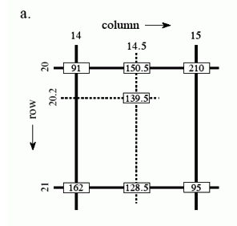
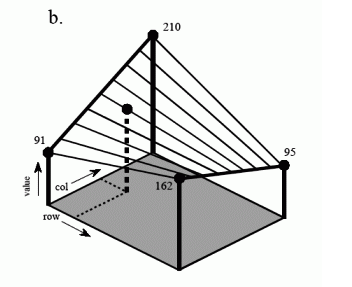

# 双线性插值

双线性插值（binliear interpolation)可以用来做图像resize。所谓“双线性”，“双”指的是在x,y两个方向上分别做线性插值，它们的结果再做一次线性插值。

## 1维线性插值

首先来理解一个方向上的线性插值。如下图所示，A、B分别表示1维图像上的两个像素点的强度（像素值），M是A、B之间的一点；A和B的距离为1，A和M的距离为x，M和B的距离为1-x；A、B、M的高度不同，表示”像素值不同”。


设A点像素值为`hA`，B点像素值为`hB`，M点像素值为`hM`，那么从相似三角形性质可得到：

```
 x     hA - hM
--- = ----------
1-x    hM - hB

=> x hM  - x hA = hA - hM - x hA + x hM

=> hM = (1-x) hA + x hB
```

上图中`hA>hB`，推导出的`hM = (1-x)hA + hB`对于`hA<=hB`时也成立（原因：A和B互换位置，则x和1-x也要互换，因而结果不变）。


## 2维性插值（双线性插值）

如下图所示，A、B、C、D是4个像素点，M是等待被计算出来的点，这张图是不考虑像素值大小情况下的点的空间位置关系。

先用A、B算出M1，用C、D算出M2，然后用M1、M2算出M；
也可以用A、C算出M3，B、D算出M4，然后用M3和M4算出M。

则容易知道：
```
hM1 = (1-x) hA + x hB
hM2 = (1-x) hC + x hD
hM  = (1-y) hM1 + y hM2 
    = (1-y) ((1-x) hA + x hB) + y ((1-x) hC + x hD)
    = (1-x)(1-y)hA + x(1-y)hB + y(1-x)hC + x y hD
```


只看上面这张图略微抽象，还是具体给出像素值，并且把像素值用高度表示出来，绘制三维图像：





## RGB图像的“双线性插值”

可以认为RGB的3个通道互相独立，因此每个通道分别做“双线性插值”，并不做“跨通道融合”。
